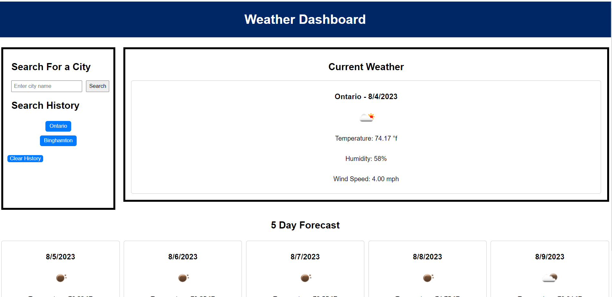

# Kens-Weather-DashBoard

## Description

The Weather DashBoard Allows users to select a city and then recieve the current weather for that city as well as a 5 day future forcast

## Credits

The Open Weather Map API ws used to retrieve data for cities

## Features 
HTML
CSS
Java Script

## Link
https://kwestbrook17.github.io/Kens-Weather-DashBoard/

## License
No license was used

